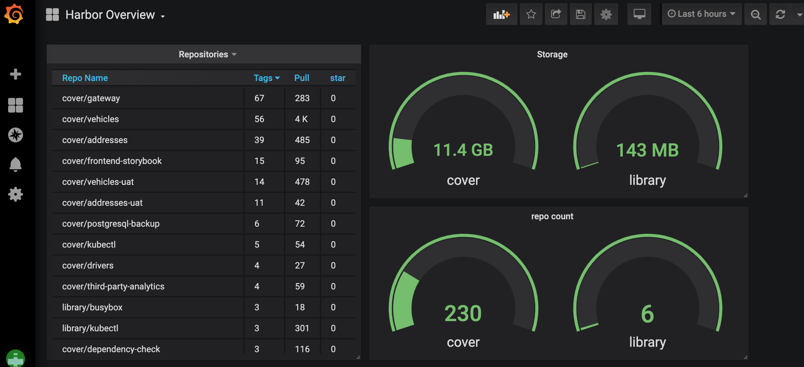

# Prometheus exporter for Harbor 

[](https://circleci.com/gh/c4po/harbor_exporter)

- [Change Log](CHANGELOG.md)

Export harbor service health to Prometheus.

To run it:

```bash
make build
./harbor_exporter [flags]
```

To build a Docker image:

```
make dockerbuild
```

## Exported Metrics

| Metric | Meaning | Labels |
| ------ | ------- | ------ |
|harbor_up| | |
|harbor_scans_completed | | |
|harbor_scans_total | | |
|harbor_scans_requester | | |
|harbor_project_count_total| |type=[private_project, public_project, total_project]|
|harbor_repo_count_total| |type=[private_repo, public_repo, total_repo]|
|harbor_quotas_count_total| |repo_id, repo_name, type=[hard, used]|
|harbor_quotas_size_bytes| | repo_id, repo_name, type=[hard, used]|
|harbor_system_volumes_bytes| |storage=[free, total]|
|harbor_repositories_pull_total| |repo_id, repo_name|
|harbor_repositories_star_total| |repo_id, repo_name|
|harbor_repositories_tags_total| |repo_id, repo_name|
|harbor_replication_status|status of the last execution of this replication policy: Succeed = 1, any other status = 0|repl_pol_name|
|harbor_replication_tasks|number of replication tasks, with various results, in the latest execution of this replication policy|repl_pol_name, result=[failed, succeed, in_progress, stopped]|

_Note: when the harbor.instance flag is used, each metric name starts with `harbor_instancename_` instead of just `harbor_`._

### Flags

```bash
./harbor_exporter --help
```

### Environment variables
Below environment variables can be used instead of the corresponding flags. Easy when running the exporter in a container.

```
HARBOR_INSTANCE
HARBOR_URI
HARBOR_USERNAME
HARBOR_PASSWORD
```

## Using Docker

You can deploy this exporter using the Docker image.

For example:

```bash
docker pull c4po/harbor-exporter

docker run -d -p 9107:9107 -e HARBOR_USERNAME=admin -e HARBOR_PASSWORD=password c4po/harbor-exporter --harbor.server=https://harbor.dev
```
### Run in Kubernetes

if you deploy Harbor to Kubernetes using the helm chart [goharbor/harbor-helm](https://github.com/goharbor/harbor-helm), you can use this file [kubernetes/harbor-exporter.yaml](kubernetes/harbor-exporter.yaml) to deploy the `harbor-exporter` with `secretKeyRef`

## Using Grafana

You can load this json file [grafana/harbor-overview.json](grafana/harbor-overview.json) to Grafana instance to have the dashboard. 
